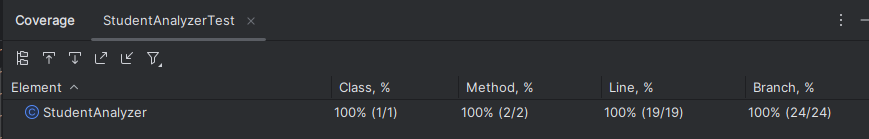
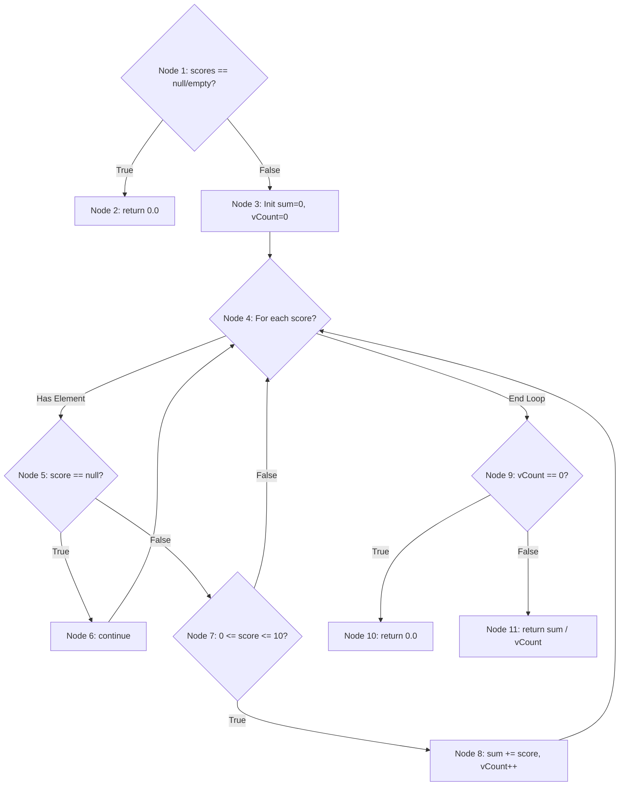

# Báo cáo Thực hành Kiểm thử Phần mềm

Repo này chứa các bài tập thực hành và báo cáo kết quả kiểm thử phần mềm.

---

## Phần 1: Báo cáo Kết quả Self-Test UI/UX

### 1. Thông tin thực hiện
- **Ngày:** 05/01/2026
- **Bài test:** [Can't Unsee](https://cantunsee.space/)
- **Mục tiêu:** Kiểm tra khả năng nhận diện chi tiết trong thiết kế giao diện (padding, typography, contrast, v.v.).

### 2. 🏆 Kết quả
- **Điểm số đạt được:** 7930

### 3. Ảnh minh chứng

---

## Phần 2: Bài tập thực hành kiểm thử với JUnit 5
**Chủ đề:** Phân tích dữ liệu điểm số học sinh (`StudentAnalyzer`)

### 1. Tổng quan dự án
Class `StudentAnalyzer` cung cấp các chức năng xử lý danh sách điểm số:
- `countExcellentStudents`: Đếm số học sinh giỏi (>= 8.0), có cơ chế lọc dữ liệu rác.
- `calculateValidAverage`: Tính điểm trung bình trên các điểm hợp lệ.

### 2. Cấu trúc thư mục
* `unit-test/src/`: Mã nguồn Java (`StudentAnalyzer.java`).
* `unit-test/test/`: Mã nguồn kiểm thử (`StudentAnalyzerTest.java`).

### 3. Kết quả Code Coverage
Độ bao phủ đạt tuyệt đối **100%** cho tất cả các chỉ số (Instruction, Branch, Line), đảm bảo mọi logic rẽ nhánh đều đã được kiểm tra.

| Element | Class | Method | Line | Branch |
| :--- | :--- | :--- | :--- | :--- |
| **StudentAnalyzer** | 100% | 100% | 100% | 100% |

---

## Phần 3: Bài tập thực hành kiểm thử tự động End-to-End với Cypress
**Chủ đề:** Kiểm thử luồng chức năng trang web thương mại điện tử (E-commerce)

### 1. Giới thiệu
Sử dụng **Cypress** để thực hiện kiểm thử tự động End-to-End (E2E) cho trang web mẫu [Swag Labs (SauceDemo)](https://www.saucedemo.com). Bài tập tập trung vào việc mô phỏng hành vi người dùng thực tế từ đăng nhập đến thanh toán.

### 2. Các kịch bản kiểm thử (Test Scenarios)
Dự án bao gồm 2 file kiểm thử chính nằm trong thư mục `cypress/e2e/`:

* **`login_spec.cy.js` (Kiểm thử Đăng nhập):**
    * ✅ Đăng nhập thành công với tài khoản hợp lệ (`standard_user`).
    * ✅ Hiển thị thông báo lỗi chính xác khi nhập sai thông tin (`invalid_user`).

* **`cart_spec.cy.js` (Kiểm thử Giỏ hàng & Thanh toán):**
    * ✅ Thêm sản phẩm vào giỏ hàng và kiểm tra số lượng (Badge count).
    * ✅ Sắp xếp danh sách sản phẩm theo giá (Thấp đến Cao).
    * ✅ Xóa sản phẩm khỏi giỏ hàng.
    * ✅ Thực hiện quy trình thanh toán đầy đủ (Checkout Flow): Giỏ hàng -> Điền thông tin -> Xác nhận -> Hoàn tất.

### 3. Kết quả kiểm thử (Evidence)
**Kết quả kịch bản Đăng nhập:**

**Kết quả kịch bản Giỏ hàng & Thanh toán:**

---

## Phần 4: Chi tiết Kỹ thuật Kiểm thử Hộp đen (Black-box Testing)
*Phần này phân tích chi tiết cách áp dụng các kỹ thuật kiểm thử vào dự án JUnit (StudentAnalyzer) ở Phần 2.*

### 1. Phân hoạch Tương đương (Equivalence Partitioning - EP)
Chia miền dữ liệu thành các lớp tương đương để đại diện cho các trường hợp Valid và Invalid.

| Lớp (Class) | Dữ liệu Test (Input) | Kết quả Mong đợi | Tên hàm Test |
| :--- | :--- | :--- | :--- |
| **Valid (Happy Path)** | `[9.0, 8.5, 7.0]` | Count: 2 | `testCountExcellentStudents_NormalCase` |
| **Invalid (Negative)** | `[-1.0, -10.0]` | Count: 0 (Ignore) | `testCountExcellentStudents_InvalidScores_Negative` |
| **Invalid (Overflow)** | `[10.1, 100.0]` | Count: 0 (Ignore) | `testCountExcellentStudents_InvalidScores_GreaterThan10` |
| **Special (Null/Empty)** | `null` hoặc `[]` | Return 0 | `testCountExcellentStudents_NullInput` |

### 2. Phân tích Giá trị Biên (Boundary Value Analysis - BVA)
Kiểm thử tập trung tại các điểm biên `0.0`, `8.0`, `10.0` với độ chính xác cao (`epsilon`).

| Điểm biên | Giá trị Test | Ý nghĩa | Kết quả Mong đợi |
| :--- | :--- | :--- | :--- |
| **Min Valid** | `0.0` | Hợp lệ thấp nhất | Được tính vào Average |
| **Just Below Excellent** | `7.9999` | Sát ngưỡng giỏi | KHÔNG đếm là Giỏi |
| **Excellent Threshold** | `8.0` | Ngưỡng giỏi | Đếm là Giỏi |
| **Just Above Excellent** | `8.0001` | Trên ngưỡng giỏi | Đếm là Giỏi |
| **Max Valid** | `10.0` | Hợp lệ cao nhất | Đếm là Giỏi |
| **Invalid Boundary** | `10.0001` | Vừa chớm Invalid | Bị loại bỏ (Skip) |

👉 **Hàm test:** `testCountExcellentStudents_BoundaryPrecision`, `testCalculateValidAverage_BoundaryPrecision`.

### 3. Bảng Quyết Định (Decision Table Testing)
Kỹ thuật này được sử dụng để xác định hành vi của hệ thống đối với từng loại trạng thái dữ liệu đầu vào.

| Trạng thái input | Trong [0, 10] | Trong [8, 10] | Ảnh hưởng trung bình | Đếm giỏi |
| :--- | :---: | :---: | :--- | :--- |
| **null** | - | - | Bỏ qua | Bỏ qua |
| **< 0** | Không | Không | Bỏ qua | Bỏ qua |
| **> 10** | Không | Không | Bỏ qua | Bỏ qua |
| **0 ≤ điểm < 8** | Có | Không | Tính vào trung bình | Bỏ qua |
| **8 ≤ điểm ≤ 10** | Có | Có | Tính vào trung bình | Tăng bộ đếm |

**Kiểm thử trạng thái danh sách:**
| Trạng thái danh sách | Kết quả Average | Kết quả Count Excellent |
| :--- | :---: | :---: |
| `scores == null` | 0.0 | 0 |
| Danh sách rỗng | 0.0 | 0 |
| Chỉ chứa null/ngoài 0-10 | 0.0 | 0 |
| Có ít nhất một điểm hợp lệ | Trung bình điểm hợp lệ | Số lượng điểm trong [8, 10] |

### 4. Đồ thị dòng điều khiển (Control Flow Graph - CFG)
Dưới đây là sơ đồ CFG cho hàm `calculateValidAverage` để minh chứng cho việc bao phủ các luồng logic:

### Phần 5: Chi tiết Kỹ thuật Kiểm thử Hộp trắng (White-box Testing)
*Phần này phân tích cấu trúc mã nguồn thông qua đồ thị và luồng dữ liệu của hàm `calculateValidAverage`.*

### 1. Phân tích Đồ thị dòng điều khiển (CFG)
Dựa trên sơ đồ Mermaid ở Phần 4, các Test Case đã bao phủ các nhánh chính như sau:
- **Path 1-2:** Bao phủ bởi `testCalculateValidAverage_NullInput`.
- **Path 5-6-4:** Kiểm tra xử lý phần tử `null`, bao phủ bởi `testDecisionTable_MixedRules_ComplexScenario`.
- **Path 7-8-4:** Nhánh tính toán điểm hợp lệ, bao phủ bởi `testCalculateValidAverage_NormalCase`.
- **Path 9-10:** Nhánh phòng tránh lỗi chia cho 0, bao phủ bởi `testCalculateValidAverage_AllInvalid`.

### 2. Phân tích Dòng dữ liệu (Data Flow Graph - DFG)
Tập trung kiểm soát vòng đời của biến then chốt: `validCount`.

| Cặp Def-Use | Vị trí (Dòng) | Loại Use | Test Case bao phủ |
| :--- | :--- | :--- | :--- |
| **Def** (vCount = 0) | 36 | Khởi tạo | Mọi test case |
| **Def -> Use** | 36 -> 46 | **p-use** (Cập nhật) | `testCalculateValidAverage_NormalCase` |
| **Def -> Use** | 36 -> 50 | **c-use** (Logic) | `testCalculateValidAverage_AllInvalid` |
| **Def -> Use** | 46 -> 54 | **c-use** (Tính toán) | `testCalculateValidAverage_NormalCase` |

**Kết luận:** Việc kết hợp CFG và DFG giúp đảm bảo mã nguồn không có "điểm chết" (Unreachable code) và các biến luôn được sử dụng một cách hợp lý trước khi trả về kết quả.
